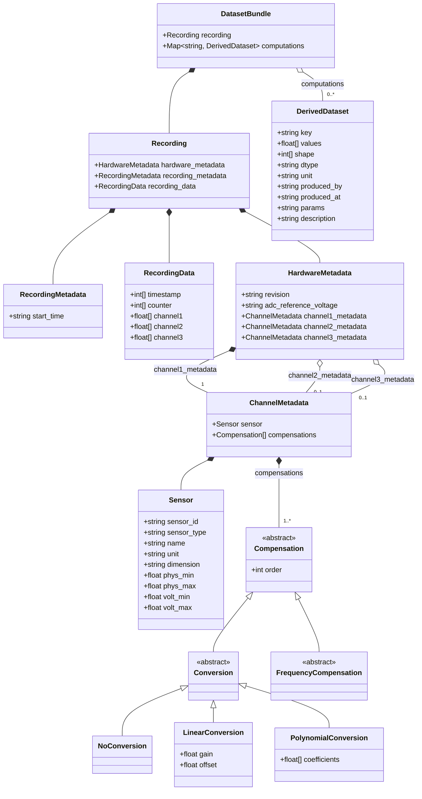

# ICOschema

Backend-agnostic data model for sensor/hardware recordings and their derived computations.

## Install

```sh
uv venv --allow-existing
uv sync --all-extras
```

## Usage

**Note:** In the example below we assume you installed Matplotlib:

```sh
uv pip install matplotlib
```

Other codebases should only import `Recording`/`DatasetBundle` from the top-level package:

```python
from ICOschema import Recording, DatasetBundle

import matplotlib.pyplot as plt

recording = Recording.from_hdf5("test/test_with_sensors.hdf5")
df = recording.to_dataframe()
plt.plot(recording.timestamps, recording.channel1)
plt.show()
recording.to_hdf5("some_file.hdf5")

bundle = DatasetBundle.from_hdf5("some_file.hdf5")  # recording + any DerivedDataset computations
# Note: The code below does not work, since `derived` is not defined
#       Adding the code for `derived` from the example below will not work,
#       since then `my_wavelet_transform` is not defined.
bundle = bundle.with_computation("wavelet_coefficients/channel1/details", derived)
bundle.to_hdf5("some_file.hdf5")
```

### Example use cases

**Inspect a recording without loading a full DataFrame:**

```python
recording = Recording.from_hdf5("some_file.hdf5")
print(recording.signal_loss_percentage)
print(recording.summary())                # JSON-encodable dict: per-channel min/max/mean/std, sensor info
```

**Add a derived computation and persist it alongside the recording:**

```python
from ICOschema.schema.generated.python.dataset import DerivedDataset

bundle = DatasetBundle.from_hdf5("some_file.hdf5")
coeffs = my_wavelet_transform(bundle.recording.channel1)
derived = DerivedDataset(
    key="wavelet_coefficients/channel1/details",
    values=coeffs.flatten().tolist(),
    shape=list(coeffs.shape),
    dtype=str(coeffs.dtype),
    produced_by="wavelet_transform@1.0.0",
)
bundle = bundle.with_computation(derived.key, derived)
bundle.to_hdf5("processed_file.hdf5")
```

**Replace a recording after cleanup, keeping existing computations:**

```python
bundle = DatasetBundle.from_hdf5("some_file.hdf5")
filled = fill_dropped_packets(bundle.recording)   # some dataloss fill logic
bundle = bundle.with_recording(filled)
bundle.to_hdf5("some_file.hdf5")
```

## Development

Regenerate the Python dataclasses after editing the schema:

```
uv run gen-python .\ICOschema\schema\linkml\dataset.yaml > .\ICOschema\schema\generated\python\dataset.py
```

Run the tests:

```
uv run pytest
```

## Schema



## Open questions

- All channels in a `RecordingData` share one `timestamp`/`counter` array set, i.e. one sample rate per recording. Mixing sensors with different data rates on different channels isn't representable yet — would likely need a per-channel rate/timestamp instead of one shared pair.
